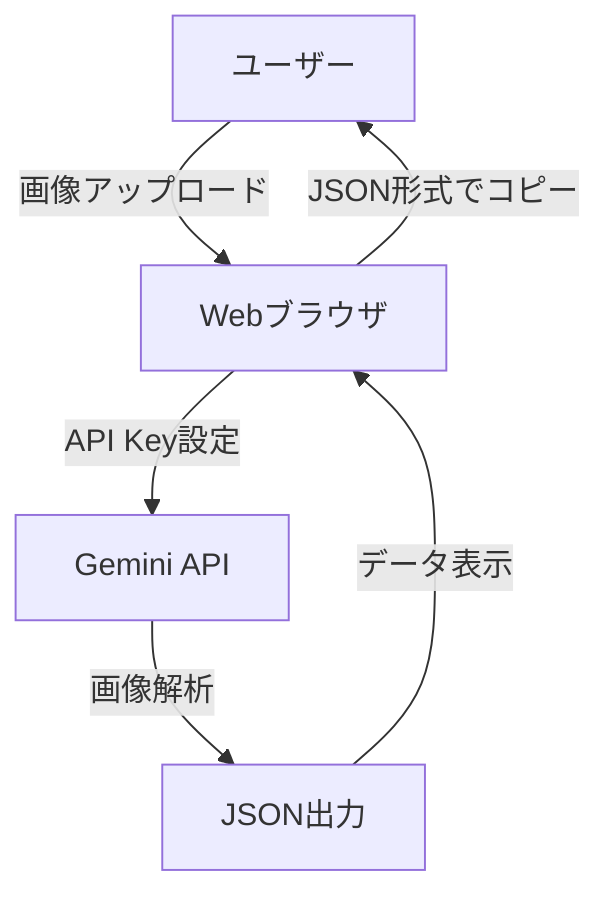
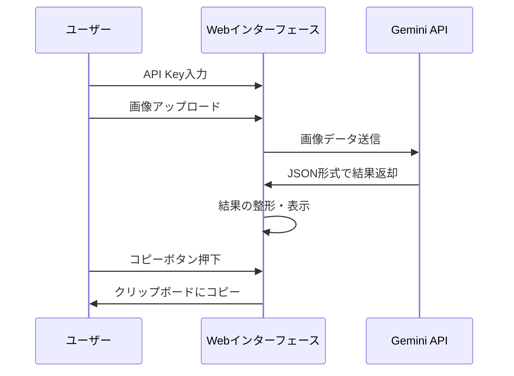

# 医療費控除申請支援ツール 設計図

## システム構成図



## 処理フロー



## ファイル構成

```
CareTaxTool/
├── index.html          # メインページ
├── src/
│   ├── css/
│   │   └── style.css   # スタイルシート
│   ├── js/
│   │   ├── main.js     # メインロジック
│   │   ├── api.js      # Gemini API関連
│   │   ├── ui.js       # UI操作関連
│   │   └── utils.js    # ユーティリティ関数
│   └── prompts/
│       └── system.txt  # システムプロンプト
└── doc/
    └── system_design.md # 本設計図
```

## コンポーネント説明

### 1. フロントエンド (HTML/CSS)
- レスポンシブデザイン
- ドラッグ&ドロップ対応の画像アップロードエリア
- マスク付きAPI Keyの入力フォーム
- 結果表示エリアとJSONコピーボタン
- エラー表示機能

### 2. バックエンド処理 (JavaScript)
- Gemini APIとの通信処理
- 画像データの前処理
- JSONデータの整形
- エラーハンドリング

### 3. データ構造
```typescript
interface MedicalReceipt {
  recipient: string;      // 受診者の名前
  facility: string;       // 病院・薬局の名称
  category: Category;     // 診察・医療カテゴリ
  amount: number;         // 支払金額
  date?: string;         // 領収書の日付（オプション）
  notes?: string;        // 備考（オプション）
}

type Category = 
  | "診察・医療"
  | "医薬品購入"
  | "介護保険サービス"
  | "その他の医療費";
```

## セキュリティ考慮事項
1. API Keyの安全な取り扱い
   - クライアントサイドでの一時的な保持のみ
   - マスク表示による保護
2. 画像データの取り扱い
   - ローカル処理のみ
   - サーバーへの保存なし

## エラーハンドリング
- API通信エラー
- 画像形式エラー
- データ解析エラー
- バリデーションエラー

## デバッグ機能
- コンソールログの実装
- エラートレース機能
- データ検証ツール 